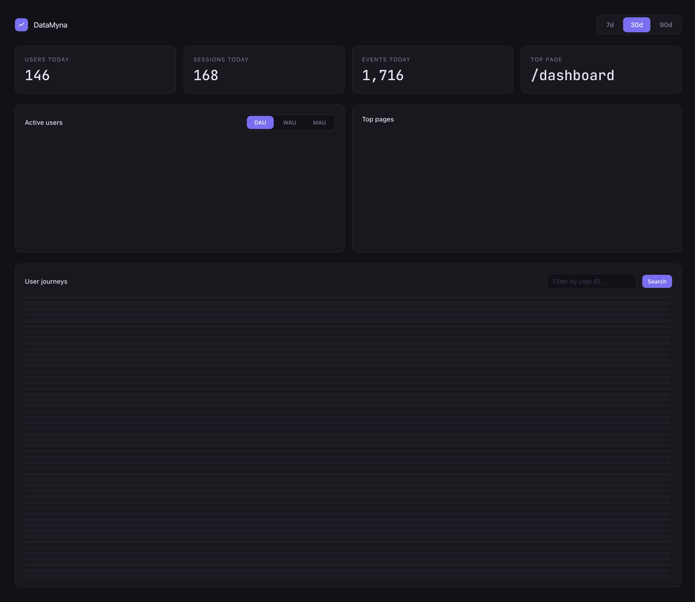

# DataMyna


A self-hostable, open-source product analytics tool. Drop in a script tag, get a dashboard.

## Screenshots



## Quick start

```bash
docker compose up
```

Open [http://localhost:5173](http://localhost:5173).

Seed the database with 120k demo events:

```bash
docker compose exec backend python seed.py
docker compose exec backend python -c "from aggregator import backfill; backfill(90)"
```

---

## Embed the tracker

```html
<script src="http://localhost:8000/tracker.js"></script>

<!-- Named event on any element -->
<button data-track="signup_click">Sign up</button>

<!-- Programmatic event -->
<script>
  datamyna.track("upgrade_click", { plan: "pro" });
  datamyna.identify("user_123"); // call after login
</script>
```

---

## Architecture

```
tracker.js  →  POST /ingest  →  raw_events (append-only)
                                      │
                                 aggregator (hourly)
                                      │
                         ┌────────────┼────────────┐
                    dau_summary  top_pages   event_summary
                         │           │             │
                         └────────────┴────────────┘
                                      │
                             GET /dau, /top-pages …
                                      │
                              Vue 3 dashboard

User journey (drill-in):
  GET /sessions         → reads sessions summary table
  GET /sessions/:id/events → reads raw_events filtered by session_id (indexed)
```

---

## Endpoints

| Method | Path                                       | Description                           |
| ------ | ------------------------------------------ | ------------------------------------- |
| POST   | `/ingest`                                  | Receive event batches from tracker.js |
| GET    | `/dau?days=30`                             | Daily unique users                    |
| GET    | `/wau?weeks=12`                            | Weekly unique users                   |
| GET    | `/mau?months=6`                            | Monthly unique users                  |
| GET    | `/top-pages?days=7`                        | Top 10 pages by views                 |
| GET    | `/events/timeline?event_name=signup_click` | Named event over time                 |
| GET    | `/stats/today`                             | Today's KPI snapshot                  |
| GET    | `/sessions?days=7&user_id=u_001`           | Session list                          |
| GET    | `/sessions/:id/events`                     | Full event sequence for one session   |

---

## Scaling notes

The current setup uses pre-aggregated summary tables as a lightweight data mart. Raw events are append-only and never queried directly by the dashboard (except the per-session drill-in, which is an indexed lookup, not a scan).

At higher ingest volumes, natural next steps are:

- **Redis queue** between `/ingest` and the DB writer to absorb write spikes without blocking the API
- **Parquet exports** of raw_events for cheap long-term storage queryable with DuckDB
- **TimescaleDB or ClickHouse** for partitioned time series at very large scale, with compression and columnar storage
- **HyperLogLog** in the aggregator for exact WAU/MAU counts (the current approach sums daily uniques and may double-count cross-day users)
